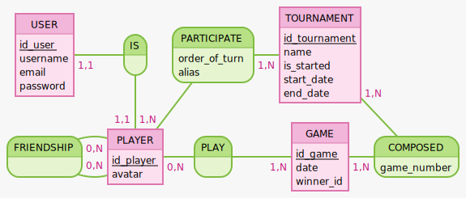

### MLD 

- **USER**
  - `id_user`
  - `username`
  - `email`
  - `password`
  - `creation_date` (//pour RGPD)
  - `langue` 

- **PLAYER**
  - `id_player`
  - `avatar`

- **FRIENDSHIP**
  - `id_player1`
  - `id_player2`

- **PLAY**
  - `#id_player`
  - `#id_game`

- **GAME**
  - `id_game`
  - `date`
  - `score` (?)
  - `winner_id`

- **PARTICIPATE**
  - `#id_player`
  - `#id_tournament`
  - `order_of_turn`
  - `alias`

- **TOURNAMENT**
  - `id_tournament`
  - `name`
  - `is_started`
  - `start_date`
  - `end_date`

- **COMPOSED**
  - `#id_tournament`
  - `#id_game`
  - `game_number`

### Notes  

Mocodo script
```

USER: id_user, username, email, password
IS, 11 USER,  11 PLAYER
PARTICIPATE, 1N TOURNAMENT, 1N PLAYER: order_of_turn, alias
TOURNAMENT: id_tournament, name, is_started, start_date, end_date
:

FRIENDSHIP, 0N [friend] PLAYER, 0N [friend_of] PLAYER
PLAYER: id_player, avatar
PLAY, 0N PLAYER, 1N GAME
GAME: id_game, date, winner_id
COMPOSED, 1N TOURNAMENT, 1N GAME: game_number

```

<!-- ```

TOURNAMENT: id tournament, name, is_started, start date, end date
PARTICIPATE, 1N TOURNAMENT, 1N PLAYER: order_of_turn, alias
:

COMPOSED, 1N TOURNAMENT, 1N GAME: game_number
PLAYER: id player
FRIENDSHIP, 0N [friend] PLAYER, 0N [friend_of] PLAYER

GAME: id game, date,winner_id,  is_started, start date, end date
PLAY, 0N PLAYER, 1N GAME
:

``` -->
