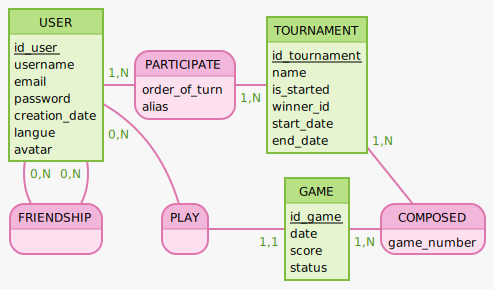

### MLD 

- **USER**
  - `id_user` int, cle primaire
  - `username` varchar
  - `email` varchar
  - `password` varchar
  - `creation_date` datetime (//pour RGPD)
  - `langue` varchar
  - `avatar` varchar

- **FRIENDSHIP**
  - `#id_player1` int, cle etrangere (PLAYER)
  - `#id_player2` int, cle etrangere (PLAYER)

- **GAME**
  - `id_game` int, cle primaire
  - `date` datetime
  - `#player_1_id` int, cle etrangere (PLAYER)\
  - `#player_2_id` int, cle etrangere (PLAYER)
  - `#winner_id` int, cle etrangere (PLAYER)
  - `score` int
  - `status`varchar ou enum (game.started, game.finished, game.canceled)

- **PARTICIPATE**
  - `#id_player` int, cle etrangere (PLAYER)
  - `#id_tournament` int, cle etrangere (TOURNAMENT)
  - `order_of_turn` int
  - `alias` varchat

- **TOURNAMENT**
  - `id_tournament` int, cle primaire
  - `name` varchat
  - `is_started` boolean
  - `#winner_id` int, cle etrangere (PLAYER)

- **COMPOSED**
  - `#id_tournament` int, cle etrangere (TOURNAMENT)
  - `#id_game` int, cle etrangere (GAME)
  - `game_number` int


### Methodes  
Chaque evenement metier = endpoint

- liste des methodes

Inscription et gestion des utilisateurs :
user.registered
user.logged_in
user.updated_profile
user.password_changed
user.account_deleted

Gestion des joueurs et des parties :
player.started_a_game
player.started_a_tournament
game.is_won_by(player)
game.started
game.finished
game.score_updated
game.canceled

Friend:
player.became_friend_with(other_player)
player.sent_friend_request
player.accepted_friend_request
player.refused_friend_request

Participation aux tournois :
tournament.player_joined
tournament.started
tournament.finished


### Notes  

Mocodo script
```

USER: id_user, username, email, password
IS, 11 USER,  11 PLAYER
PARTICIPATE, 1N TOURNAMENT, 1N PLAYER: order_of_turn, alias
TOURNAMENT: id_tournament, name, is_started, start_date, end_date
:

FRIENDSHIP, 0N [friend] PLAYER, 0N [friend_of] PLAYER
PLAYER: id_player, avatar
PLAY, 0N PLAYER, 1N GAME
GAME: id_game, date, winner_id
COMPOSED, 1N TOURNAMENT, 1N GAME: game_number

```

<!-- ```
USER: id_user, username, email, password, creation_date, langue, avatar
PARTICIPATE, 1N USER, 1N TOURNAMENT: order_of_turn, alias
TOURNAMENT: id_tournament, name, is_started, winner_id, start_date, end_date

FRIENDSHIP, 0N [friend] USER, 0N [friend_of] USER
PLAY, 0N USER, 11 GAME
GAME: id_game, date, score, status
COMPOSED, 1N TOURNAMENT, 1N GAME: game_number


``` -->
